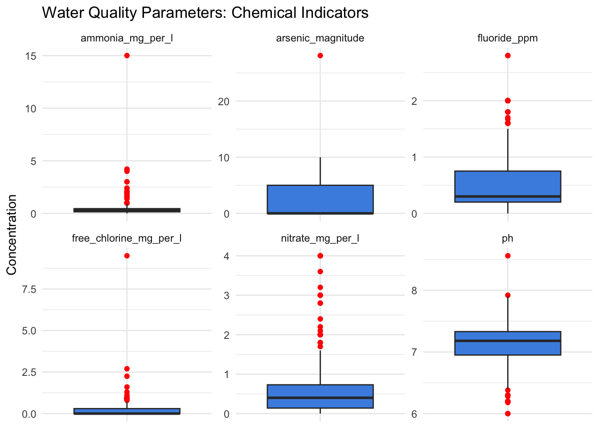

# USAID Flood Response – Post Intervention Survey (Mulanje, 2019–2020)

[](https://zenodo.org/doi/10.5281/zenodo.15837460)
[](https://github.com/openwashdata/postfloodintervention/actions/workflows/R-CMD-check.yaml)

This dataset contains detailed post-intervention monitoring data for
rural water points in the Mulanje district of Malawi, collected as part
of the USAID Flood Response program during 2019 and 2020. Using the
mWater mobile data collection platform, enumerators conducted on-site
assessments of water point conditions following flood recovery efforts.

The data captures a comprehensive range of water point characteristics,
including physical condition through photographs, operational
performance of pumps, and hydraulic measurements such as time and effort
required to pump a standard volume of water. Additionally, water quality
parameters were rigorously tested—covering chemical contaminants like
arsenic, ammonia, fluoride, nitrate, free chlorine, and total dissolved
solids, as well as physical indicators such as pH, temperature, and
turbidity.

Microbiological quality was assessed via E. coli concentrations,
including counts per 100 milliliters, confidence intervals, and risk
classifications, supported by photographic documentation of test
results. These indicators provide critical insight into the safety and
usability of water sources after flood-related disruptions.

### Use Cases

This dataset serves multiple practical purposes for water management and
public health:

- **Evaluating the effectiveness** of flood recovery interventions on
  water infrastructure.

- **Monitoring water quality trends** to identify ongoing or emerging
  contamination risks.

- **Informing maintenance and rehabilitation priorities** based on pump
  performance and structural assessments.

- **Supporting public health risk assessments** through microbial
  contamination data.

- **Providing evidence for community-level decision making** and donor
  reporting.

- **Guiding future emergency preparedness and response planning** for
  water systems in flood-prone areas.

### Potential Users

The dataset is highly valuable to a range of stakeholders including:

1.  Government agencies responsible for water supply and sanitation,
    particularly at the district and national levels.

2.  International donor organizations and development partners managing
    WASH and disaster recovery programs.

3.  Field engineers and technical teams engaged in infrastructure repair
    and monitoring.

4.  Public health officials tracking waterborne disease risks.

5.  Researchers studying environmental health, water security, and
    climate resilience.

6.  NGOs and civil society organizations supporting community water
    management and advocacy.

## Installation

You can install the development version of postfloodintervention from
[GitHub](https://github.com/) with:

``` r

# install.packages("devtools")
devtools::install_github("openwashdata/postfloodintervention")
```

``` r

## Run the following code in console if you don't have the packages
## install.packages(c("dplyr", "knitr", "readr", "stringr", "gt", "kableExtra"))
library(dplyr)
library(knitr)
library(readr)
library(stringr)
library(gt)
library(kableExtra)
library(postfloodintervention)
data(postfloodintervention)
```

Alternatively, you can download the individual datasets as a CSV or XLSX
file from the table below.

1.  Click Download CSV. A window opens that displays the CSV in your
    browser.
2.  Right-click anywhere inside the window and select “Save Page As…”.
3.  Save the file in a folder of your choice.

| dataset | CSV | XLSX |
|:---|:---|:---|
| postfloodintervention | [Download CSV](https://github.com/openwashdata/postfloodintervention/raw/main/inst/extdata/postfloodintervention.csv) | [Download XLSX](https://github.com/openwashdata/postfloodintervention/raw/main/inst/extdata/postfloodintervention.xlsx) |

## Data

The package provides access to post-intervention monitoring data for
rural water points in the Mulanje district of Malawi, collected as part
of the USAID Flood Response program during 2019 and 2020.

### postfloodintervention

The dataset `postfloodintervention` contains 308 observations and 30
variables

``` r

postfloodintervention |> 
  head(3) |> 
  gt::gt() |>
  gt::as_raw_html()
```

| submitted_on | water_point_name | latitude | longitude | photo_condition_water_point | operational_feel_of_pump | time_to_pump_20_litres | number_of_strokes_to_yield_water | sediment_presence | electrical_conductivity_magnitude | electrical_conductivity_units | arsenic_magnitude | arsenic_units | ammonia_mg_per_l | fluoride_ppm | nitrate_mg_per_l | total_dissolved_solids_ppt | free_chlorine_mg_per_l | ph | temperature_magnitude | temperature_units | turbidity_tube_magnitude | turbidity_tube_units | comments | type_of_sample | date_of_sample | ecoli_mpn_per_100ml | ecoli_upper_95ci_per_100ml | ecoli_health_risk_category | ecoli_image |
|---:|:---|---:|---:|:---|:---|---:|---:|:---|---:|:---|---:|:---|---:|---:|---:|---:|---:|---:|---:|:---|---:|:---|:---|:---|---:|---:|---:|:---|:---|
| 08/07/2019 | Beseni borehole | -15.62573 | 35.51046 | <https://api.mwater.co/v3/images/8b33e91a7390478ea15a6177ebb6f3c6>; <https://api.mwater.co/v3/images/f21ced7742364d85b5241f2d29d765e8> | Normal/satisfactory | 70.040 | 1 | Absent | 5740.0 | μS / cm | 5 | ppb | 0.20 | 1.6 | 0.60 | 2.79 | 0.0 | 7.06 | 25.2 | C | 5 | NTU | NA | Point of collection | 7/5/2019 | 0 | 2.87 | safe | <https://api.mwater.co/v3/images/5d6f60f749f6499098680d27094e3d59> |
| 05/12/2019 | Demula borehole 3 | -15.96436 | 35.47770 | <https://api.mwater.co/v3/images/1b9e5eb6d4d14feca18ca7ac63d7d1d1> | Normal/satisfactory | 44.811 | 2 | Absent | 136.1 | μS / cm | 0 | ppb | 0.64 | 0.3 | 0.58 | 0.08 | 0.3 | 6.00 | 30.0 | C | 5 | NTU | NA | Point of collection | 12/4/2019 | 0 | 2.87 | safe | <https://api.mwater.co/v3/images/b455ed0a2f864d30ab94c1ec833cfda2> |
| 23/02/2020 | Demula borehole 3 | -15.96436 | 35.47770 | <https://api.mwater.co/v3/images/14fd52d3d6a4466b878bba3360fd45d6> | Normal/satisfactory | 43.208 | 2 | Absent | 140.2 | μS / cm | 0 | ppb | 0.61 | 0.2 | 0.50 | 0.09 | 0.9 | 6.80 | 30.4 | C | 5 | NTU | NA | Point of collection | 2/22/2020 | 0 | 2.87 | safe | <https://api.mwater.co/v3/images/966e6d52075f4273b45288d5e2eea8e4> |

For an overview of the variable names, see the following table.

| variable_name | variable_type | description |
|:---|:---|:---|
| submitted_on | character | Date when the survey was submitted |
| water_point_name | character | Name of the water point |
| latitude | numeric | Geographic latitude coordinate of the water point |
| longitude | numeric | Geographic longitude coordinate of the water point |
| photo_condition_water_point | character | File names or URLs of photos illustrating the current condition of the water point |
| operational_feel_of_pump | character | Qualitative assessment of how the pump feels during operation |
| time_to_pump_20_litres | numeric | Time taken (in seconds or minutes) to pump 20 liters of water |
| number_of_strokes_to_yield_water | numeric | Number of pump strokes needed to produce water |
| sediment_presence | character | Presence or absence of sediment in the water |
| electrical_conductivity_magnitude | numeric | Measured magnitude of electrical conductivity in the water sample |
| electrical_conductivity_units | character | Units of electrical conductivity measurement (e.g., μS/cm) |
| arsenic_magnitude | numeric | Concentration of arsenic detected in the water sample |
| arsenic_units | character | Units used to measure arsenic concentration (e.g., μg/L) |
| ammonia_mg_per_l | numeric | Ammonia concentration in mg per liter |
| fluoride_ppm | numeric | Fluoride concentration in parts per million |
| nitrate_mg_per_l | numeric | Nitrate concentration in mg per liter |
| total_dissolved_solids_ppt | numeric | Total dissolved solids in parts per thousand |
| free_chlorine_mg_per_l | numeric | Concentration of free chlorine in mg per liter |
| ph | numeric | pH level of the water sample (acidity/alkalinity) |
| temperature_magnitude | numeric | Temperature value of the water sample |
| temperature_units | character | Units for temperature measurement (degree celsius) |
| turbidity_tube_magnitude | numeric | Measured turbidity of water using a turbidity tube |
| turbidity_tube_units | character | Units for turbidity measurement (e.g., NTU) |
| comments | character | Additional notes or observations related to the water point or sample |
| type_of_sample | character | Type or source of the water sample (e.g., well, tap, river) |
| date_of_sample | character | Date when the water sample was collected |
| ecoli_mpn_per_100ml | numeric | Most probable number (MPN) of E. coli bacteria per 100 milliliters |
| ecoli_upper_95ci_per_100ml | numeric | Upper limit of the 95 percent confidence interval for E. coli MPN per 100 ml |
| ecoli_health_risk_category | character | Health risk classification based on E. coli levels (e.g., low, medium, high) |
| ecoli_image | character | File name or URL of image showing E. coli test result or sample compartment color change |

## Example

``` r

## Run the following code in console if you don't have the packages
## install.packages(c("postfloodintervention", "tidyverse"))
library(postfloodintervention)

# Water Quality Parameters
# Purpose: Multi-panel boxplots for chemical indicators (arsenic, fluoride, nitrate, ammonia, free chlorine, pH) to detect outliers or contamination patterns.

# Load libraries
library(tidyverse)

# Select relevant chemical columns and pivot longer for plotting
chemicals_long <- postfloodintervention %>%
  select(arsenic_magnitude, fluoride_ppm, nitrate_mg_per_l, ammonia_mg_per_l, free_chlorine_mg_per_l, ph) %>%
  pivot_longer(
    cols = everything(),
    names_to = "chemical",
    values_to = "value"
  ) %>%
  filter(!is.na(value))  # Remove missing values

# Plot multi-panel boxplots
ggplot(chemicals_long, aes(x = chemical, y = value)) +
  geom_boxplot(fill = "#4a90e2", outlier.color = "red") +
  facet_wrap(~ chemical, scales = "free") +   # Free y-scale per chemical
  labs(
    title = "Water Quality Parameters: Chemical Indicators",
    x = NULL,
    y = "Concentration"
  ) +
  theme_minimal() +
  theme(axis.text.x = element_blank(),   # Hide x labels since facets show names
        axis.ticks.x = element_blank())
```



## License

Data are available as
[CC-BY](https://creativecommons.org/licenses/by/4.0/).

## Citation

Please cite this package using:

``` r

citation("postfloodintervention")
#> To cite package 'postfloodintervention' in publications use:
#> 
#>   Mhango E (2025). "postfloodintervention: USAID Flood Response Post
#>   Intervention Survey Data." doi:10.5281/zenodo.15837460
#>   <https://doi.org/10.5281/zenodo.15837460>.
#>   <https://github.com/openwashdata/postfloodintervention>.
#> 
#> A BibTeX entry for LaTeX users is
#> 
#>   @Misc{mhango:2025,
#>     title = {postfloodintervention: USAID Flood Response Post Intervention Survey Data},
#>     author = {Emmanuel Mhango},
#>     year = {2025},
#>     doi = {10.5281/zenodo.15837460},
#>     url = {https://github.com/openwashdata/postfloodintervention},
#>     abstract = {Post-intervention monitoring data for rural water points in the Mulanje district of Malawi, collected as part of the USAID Flood Response program during 2019-2020. The dataset includes comprehensive water point assessments covering physical condition, operational performance, hydraulic measurements, water quality parameters, and microbiological quality assessments.},
#>     keywords = {open data,washdata,water points,water quality,boreholes,rehabilitation,flood response,E. coli,Malawi},
#>     version = {0.1.2},
#>   }
```
